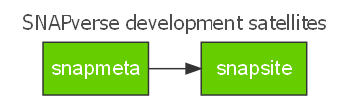

<!-- README.md is generated from README.Rmd. Please edit that file -->
snapmeta
========

[](https://travis-ci.org/leonawicz/snapmeta) [](https://ci.appveyor.com/project/leonawicz/snapmeta) [](https://codecov.io/github/leonawicz/snapmeta?branch=master)

SNAPverse R package ecosystem development frozen.
-------------------------------------------------

*Development of the SNAPverse R package ecosystem has been frozen indefinitely. This project was never directly funded. I began it out of personal interest, but no longer work for SNAP. It will remain archived here for historical reference.*

`snapmeta` contains a collection of utility functions for the development of other [SNAPverse](https://leonawicz.github.io/snapverse/) packages. `snapmeta` is a satellite package of the SNAPverse collection of R packages.

<p style="text-align:center;">

</p>
<br>

Installation
------------

You can install snapmeta from github with:

``` r
# install.packages('devtools')
devtools::install_github("leonawicz/snapmeta")
```

Package setup
-------------

First, take a look at the helpful reminders in the console output from `reminders`. It will be somewhat specific to your account and project if you pass arguments. For example, using my defaults:

``` r
library(snapmeta)
reminders()
#> 1. Create a new R package via RStudio > New Project > R Package
#>   with 'Create a git repository' checked.
#> 2. Make initial commit by adding the initial .Rbuildignore, .gitignore and [pkgname].Rproj files.
#> 3. Add the repo on GitHub:
#>   Use default settings (Do not create README.md).
#>   Set docs/ directory for hosting project website (Must first push docs/ to GitHub).
#> 4. In git shell, enter:
#>   git remote add origin git@github.com:leonawicz/snapmeta.git
#>   git push -u origin master
#> 5. Then return to R console and run:
#>   snapmeta::use_these()
#>     NOTE: Run Rstudio session as Administator in Windows so usethese() can create lintr symbolic link.
#> 6. Add Travis CI, Appveyor and code coverage badges to README.Rmd. Add projects on respective sites.
#>   Badges are in console output. Remember to add the `after_success` segment to .travis.yml as well.
#> 7. Check the following:
#>   Delete absolute path to `docs` created by pkgdown in .Rbuildignore.
#>   Make initial updates to DESCRIPTION and other files, e.g., README.Rmd, vignette Rmd file, LICENSE.md.
#>   Delete NAMESPACE so it can be auto-generated via devtools.
#>   Delete any Hello World files.
#>   At least one inital unit test is required to pass build. Lintr test will suffice.
#>   Commit changes, but hold off on cran-comments.md and revdep until meaningful.
```

This should all be familiar if you develop R packages, but it can be easy to occasionally neglect a step. The recommendations are not completely universal, however, and cater specifically to SNAPverse package development.

If it meets all needs, run:

``` r
use_these()
```

If something different is needed, ignore the above wrapper function. Instead, make individual calls to whichever package setup functions are required.

Getting info from the verse
---------------------------

A table of all SNAPverse packages can be obtained by:

``` r
sv_pkgs()
#> # A tibble: 25 x 3
#>    pkg       type      local
#>    <chr>     <chr>     <lgl>
#>  1 snapverse sector    TRUE 
#>  2 snaplite  sector    FALSE
#>  3 snapdata  sector    FALSE
#>  4 snapwebs  sector    FALSE
#>  5 snapstat  functions TRUE 
#>  6 snapplot  functions TRUE 
#>  7 snaplocs  functions TRUE 
#>  8 snapprep  functions TRUE 
#>  9 alfresco  functions TRUE 
#> 10 snapclim  data      TRUE 
#> # ... with 15 more rows
```

The table includes columns giving the section of the verse a package belongs to and whether or not a local git repository/R source package exists sharing the same parent directory as the current package (current working directory). A short list of the latter existing local packages can be obtained by:

``` r
sv_local_pkgs()
#>  [1] "alfresco"  "apputils"  "jfsp"      "maputils"  "rvtable"  
#>  [6] "snapapps"  "snapclim"  "snapfire"  "snapflex"  "snapgrid" 
#> [11] "snaplocs"  "snapmeta"  "snapplot"  "snappoly"  "snapprep" 
#> [16] "snapsite"  "snapstat"  "snaputils" "snapverse"
```

Reference
---------

[Complete package reference and function documentation](https://leonawicz.github.io/snapmeta/)
